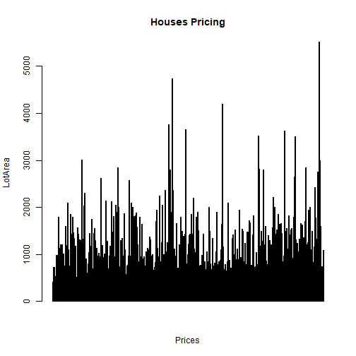
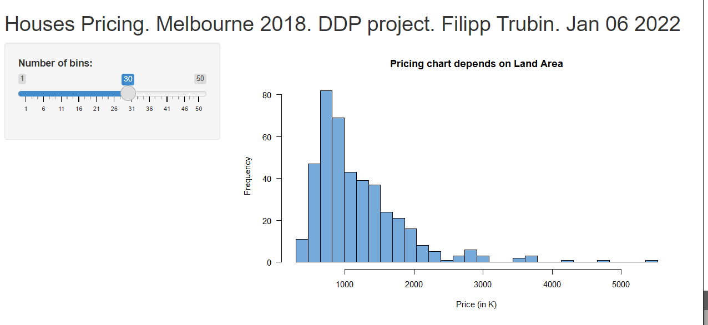

Data Science Specialization | JHU
Course project: Development Data Products
Houses Pricing. Melbourne 2018.
========================================================
author: Filipp Trubin
date: January 06 2022
autosize: true

 
========================================================

The Application reflects dependency Pricing on LandArea in Melbourne.
Dataset ib provided by estate association. 
The Graph is adjustable by tuning bin size interactively.

GitHub repo:
https://github.com/5filipp/Developing_Data_Products.git

DataSet Info
========================================================


```r
dataH <- read.csv("houses.csv")
summary(dataH)
```

```
    Suburb            Address              Rooms           Type          
 Length:423         Length:423         Min.   :1.000   Length:423        
 Class :character   Class :character   1st Qu.:3.000   Class :character  
 Mode  :character   Mode  :character   Median :3.000   Mode  :character  
                                       Mean   :3.047                     
                                       3rd Qu.:3.000                     
                                       Max.   :8.000                     
                                                                         
     Price           Method            SellerG              Date          
 Min.   : 292.0   Length:423         Length:423         Length:423        
 1st Qu.: 737.5   Class :character   Class :character   Class :character  
 Median :1000.0   Mode  :character   Mode  :character   Mode  :character  
 Mean   :1195.7                                                           
 3rd Qu.:1460.0                                                           
 Max.   :5525.0                                                           
                                                                          
    Distance         Postcode       Bedroom2        Bathroom          Car      
 Min.   : 2.500   Min.   :3018   Min.   :1.000   Min.   :0.000   Min.   :0.00  
 1st Qu.: 5.900   1st Qu.:3032   1st Qu.:2.000   1st Qu.:1.000   1st Qu.:1.00  
 Median :10.500   Median :3042   Median :3.000   Median :1.000   Median :2.00  
 Mean   : 8.831   Mean   :3079   Mean   :3.009   Mean   :1.572   Mean   :1.69  
 3rd Qu.:12.200   3rd Qu.:3147   3rd Qu.:3.000   3rd Qu.:2.000   3rd Qu.:2.00  
 Max.   :13.800   Max.   :3206   Max.   :9.000   Max.   :7.000   Max.   :8.00  
                                                                               
    Landsize       BuildingArea     YearBuilt    CouncilArea       
 Min.   :  65.0   Min.   :  3.0   Min.   :1880   Length:423        
 1st Qu.: 212.0   1st Qu.:102.0   1st Qu.:1910   Class :character  
 Median : 440.0   Median :131.0   Median :1956   Mode  :character  
 Mean   : 465.3   Mean   :153.7   Mean   :1954                     
 3rd Qu.: 609.5   3rd Qu.:176.8   3rd Qu.:1996                     
 Max.   :4290.0   Max.   :792.0   Max.   :2017                     
                  NA's   :169     NA's   :149                      
   Lattitude        Longtitude     Regionname        Propertycount 
 Min.   :-37.88   Min.   :144.8   Length:423         Min.   :2211  
 1st Qu.:-37.86   1st Qu.:144.9   Class :character   1st Qu.:3280  
 Median :-37.83   Median :144.9   Mode  :character   Median :4502  
 Mean   :-37.81   Mean   :144.9                      Mean   :4440  
 3rd Qu.:-37.77   3rd Qu.:145.0                      3rd Qu.:5301  
 Max.   :-37.72   Max.   :145.1                      Max.   :6567  
                                                                   
```

BarPlot
========================================================



Application Interface
========================================================



